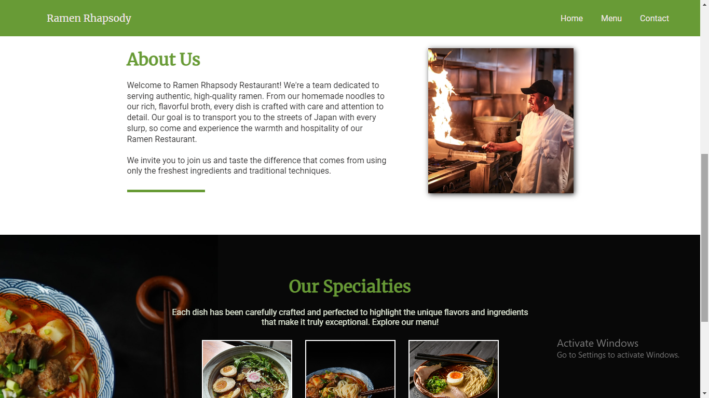

# Restaurant-page-TOP

Task from [The Odin Project](https://www.theodinproject.com/lessons/node-path-javascript-restaurant-page).   

- Focuses on bundling modules (ES6 Modules in javascript) with webpack.  
- Handling development dependencies with npm and installing packages.  
- Using a task runner (npm scripts) for automating parts of the build process ('build', 'watch')

